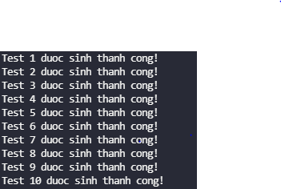
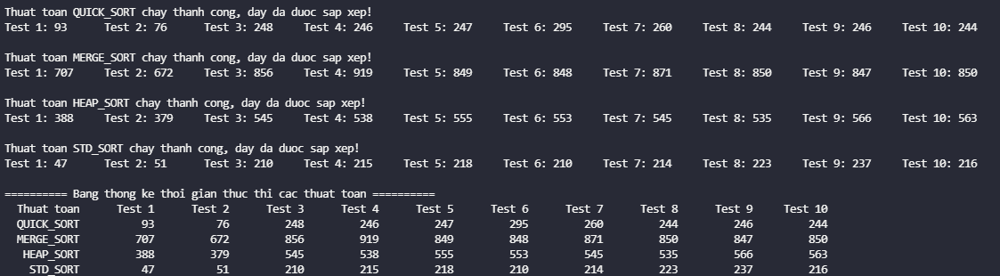
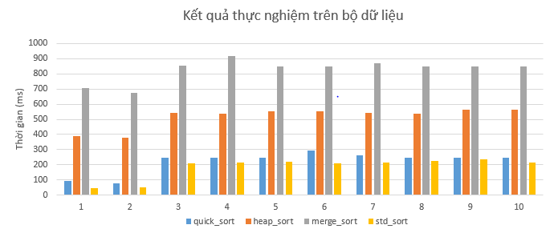

# Thực nghiệm các phương pháp sắp xếp tới hạn
## Mô tả thực nghiệm
1. Tạo bộ dữ liệu gồm 10 dãy, mỗi dãy khoảng 1 triệu số thực (ngẫu nhiên); dãy thứ nhất đã có thứ tự tăng dần, dãy thứ hai có thứ tự giảm dần, 8 dãy còn lại trật tự ngẫu nhiên
2. Viết các chương trình sắp xếp dãy theo các thuật toán QuickSort, HeapSort, MergeSort và chương trình gọi hàm sort của C++
3. Chạy thử nghiệm mỗi chương trình đã viết ở trên với bộ dữ liệu đã tạo, ghi nhận thời gian thực thi từng lần thử nghiệm
## Mô tả các thư mục trên GitHub
1. Thư mục `Data` gồm:
* `gen_data.cpp`   : Chương trình sinh bộ dữ liệu
* `output_data` : Gồm 10 file `*.txt` là bộ dữ liệu được sinh bởi `gen_data.cpp`
2. Thư mục `Source Code` gồm:
* `std_sort.h` : Mã nguồn thuật toán `std::sort`
* `heap_sort.h` : Mã nguồn thuật toán **Heap Sort**
* `quick_sort.h` : Mã nguồn thuật toán **Quick Sort**
* `merge_sort.h` : Mã nguồn thuật toán **Merge Sort**
* `main.cpp` : Chương trình thực nghiệm khảo sát thời gian thực thi các phương pháp sort trên bộ dữ liệu đã được tạo 
3. Thư mục `Image` gồm các hình ảnh khi chương trình thực thi thành công
4. File `report.pdf` : bản báo cáo và nhận xét kết quả thực nghiệm
## Tiến hành thực nghiệm:
**Bước 1:** Chạy file `gen.cpp` để khởi tạo bộ dữ liệu thực nghiệm. Kết quả khi chương trình chạy thành công:

<div align="center"> 
    
</div>

**Bước 2:** Chạy file `main.cpp` để tiến hành đo thời gian thực thi các thuật toán sort trên bộ dữ liệu vừa mới tạo. Kết quả khi chương trình chạy thành công:

<div align="center"> 
    
</div>

## Kết quả thực nghiệm
* Bảng thống kê:

|             |   Test 1   |   Test 2   |   Test 3   |   Test 4   |   Test 5   |   Test 6   |   Test 7   |   Test 8   |   Test 9   |   Test 10   |
|-------------|------------|------------|------------|------------|------------|------------|------------|------------|------------|-------------|
|  QUICK_SORT |     93     |     76     |    248     |    246     |    247     |    295     |    260     |    244     |    246     |     244     |
|  HEAP_SORT  |    388     |    379     |    545     |    538     |    555     |    553     |    545     |    535     |    566     |     563     |
|  MERGE_SORT |    707     |    672     |    856     |    919     |    849     |    848     |    871     |    850     |    847     |     850     |  
|  STD_SORT   |     47     |     51     |    210     |    215     |    218     |    210     |    214     |    223     |    237     |     216     |

* Biểu đồ thống kê:

<div align="center"> 
    
</div>

## Nhận xét kết quả thực nghiệm
* Về mặt số liệu thì **std_sort** và **quick_sort** là hai thuật toán sắp xếp nhanh nhất (cả hai đều có thời gian thực thi trung bình xấp xỉ **N * log(N)**) trong đó **std_sort** nhanh hơn một chút so với **quick_sort**. Xếp sau đó là **heap_sort** và sau cùng là **merge_sort**
* **std_sort** trong `C++` sử dụng thuật toán **intro_sort** là sử kết hợp chủ yếu của ba thuật toán **quick_sort**, **heap_sort** và **insertion_sort** để giảm thiểu tối đa thời gian chạy bằng cách giới hạn số lần gọi đệ quy (khi số lần đệ quy vượt quá **log(N)** sẽ chuyển sang thuật toán khác là **heap_sort**)

``` 
Pesudocode:
procedure sort(A : array):
    let maxdepth = ⌊log2(length(A))⌋ × 2
    introsort(A, maxdepth)

procedure introsort(A, maxdepth):
    n ← length(A)
    if n ≤ 1:
        return  // base case
    else if maxdepth = 0:
        heapsort(A)
    else:
        p ← partition(A)  // assume this function does pivot selection, p is the final position of the pivot
        introsort(A[0:p-1], maxdepth - 1)
        introsort(A[p+1:n], maxdepth - 1)
```
Do đó nó được xem như là thuật toán sắp xếp tốt nhất hiện nay và được sử dụng rộng rãi.

* Về mặt lý thuyết thì **quick_sort** trong trường hợp tệ nhất có độ phức tạp là **O(N^2)** còn **heap_sort** và **merge_sort** thì đều có độ phức tạp là **N * log(N)** trong mọi trường hợp. Thế nhưng kết quả thực nghiệm lại cho thấy **quick_sort** chạy nhanh hơn **merge_sort** và **heap_sort**. Nguyên nhân là **quick_sort** tốn ít không gian bổ sung hơn (**merge_sort** cần thêm bộ nhớ để thực hiện thao tác trộn hai dãy đã được sắp xếp) và khả năng định vị bộ nhớ **cache** tốt hơn. Điều này ảnh hưởng tới thời gian thực thi chương trình nên trong nhiều trường hợp **quick_sort** nhanh hơn **heap_sort** và **heap_sort** sẽ nhanh hơn **merge_sort** (vì **heap_sort** không cần thêm bộ nhớ và gọi đệ quy nhiều lần như **merge_sort**)

# Tài liệu tham khảo
* [Introsort algorithm of std::sort()](https://en.wikipedia.org/wiki/Introsort)
* [Quicksort vs Mergesort and Heapsort](https://stackoverflow.com/questions/70402/why-is-quicksort-better-than-mergesort)
* [Memory location](https://pythonspeed.com/articles/performance-memory-locality/)
* [Sorting algorithms](https://www.geeksforgeeks.org/sorting-algorithms/)
